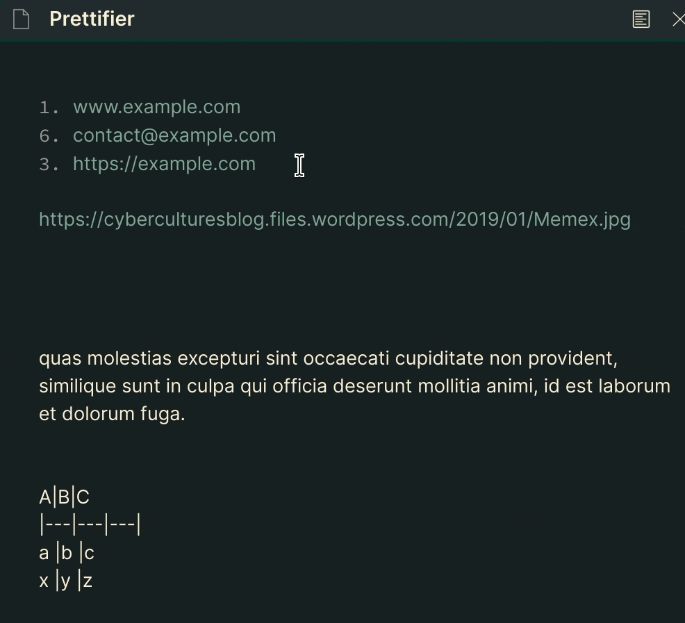

# Markdown prettifier for Obsidian

Tries to fix and reformat ugly Markdown

The default hotkey is `Ctrl+Alt+L`.

## Examples

### Autolink literals

**Example**

Before:

```markdown
www.example.com, https://example.com, and contact@example.com.
```

After:

```markdown
[www.example.com](http://www.example.com), <https://example.com>, and <contact@example.com>.
```

### Ordered lists

Normalizes ordered lists.

**Example**

Before:

```markdown
1. foo
    1. aaa
    1. bbb
    4. ccc
1. bar
1. baz
```

After:

```markdown
1.  foo
    1.  aaa
    2.  bbb
    3.  ccc
2.  bar
3.  baz
```

### Tables

Normalizes table formatting.

**Example**

Before:

```markdown
**A**|**B**|**C**
|---:|:---|---|
a |b |c
x |y |z
```

After:

```markdown
| **A** | **B** | **C** |
| ----: | :---- | ----- |
|     a | b     | c     |
|     x | y     | z     |
```

## Uses

*   [remark-gfm](https://www.npmjs.com/package/remark-gfm)
*   [remark-images](https://github.com/remarkjs/remark-images)



## How to compile the plugin

First, install the dependencies with

```bash
npm i
```

Then, you can compile the plugin with:

```bash
npm run build
```

This will create a `main.js` file in the project root. That is the entry point of your plugin.

## Manual installation

Download zip archive from [GitHub releases page](https://github.com/cristianvasquez/obsidian-prettify/releases).
Extract the archive into `<vault>/.obsidian/plugins`.

Alternatively, using bash:

```bash
OBSIDIAN_VAULT_DIR=/path/to/your/obsidian/vault
mkdir -p $OBSIDIAN_VAULT_DIR/.obsidian/plugins
unzip ~/Downloads/obsidian-prettify-0.1.zip -d $OBSIDIAN_VAULT_DIR/.obsidian/plugins
```

***

> if you want, you can send me a coffee :) <https://www.buymeacoffee.com/pelado>
